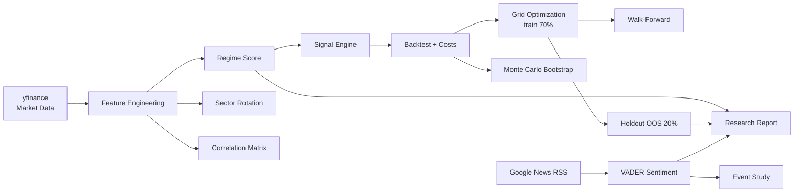

<div align="center">

# 🧭 NEXUS-QRM

### Quantitative Regime & Market Intelligence — a Colab-ready research engine

*Macro regimes • Sector rotation • Cross-asset signals • Walk-forward testing • News sentiment*

[](https://colab.research.google.com/github/YOUR_USERNAME/nexus-qrm/blob/main/notebooks/NEXUS_QRM.ipynb)


</div>

---

## 📌 Overview

**NEXUS-QRM** is a single-notebook research framework that turns raw market data into a structured
view of the macro environment — and then stress-tests a transparent trading rule built on top of it.

It runs end to end in Google Colab with **no API keys**: install, press *Run all*, read the report.

> ⚠️ **This is a research and backtesting framework, not a trading system and not financial advice.**
> Historical backtests can suffer from look-ahead bias, survivorship bias, data revisions and
> unmodelled execution costs. See [Disclaimer](#️-disclaimer).

---

## ✨ Features

| Module | What it does |
|---|---|
| 🌍 **Universe** | Indices (SPX, NDX, DJI, RUT), VIX, rates / USD proxies, commodities (Gold, Silver, Oil, Copper) and 11 SPDR sector ETFs |
| 📈 **Feature engineering** | 20D momentum, annualized realized volatility, VIX z-score, cross-asset momentum, sector breadth |
| 🧠 **Regime classifier** | Composite *Growth Score* → `Expansion / Risk-On`, `Transition`, `Contraction / Risk-Off` |
| 🔄 **Sector rotation** | Multi-horizon (1M / 3M / 6M) composite ranking with risk-adjusted momentum |
| 🔗 **Cross-asset correlation** | Rolling 60D correlation matrix + heatmap |
| ⚙️ **Signal engine** | Auditable long/short rule on SPX using momentum, volatility filter and regime score |
| 💸 **Cost analysis** | Turnover tracking and explicit transaction-cost model (gross vs. net) |
| 🎛️ **Optimization** | Grid search over momentum / volatility lookbacks on a **training sample only** |
| 🚶 **Walk-forward** | Rolling train → select → test on unseen window (756d train / 126d test) |
| 🧪 **Holdout OOS** | Final 20% of history never touched by parameter search |
| 🎲 **Monte Carlo** | 2,000-path bootstrap of strategy returns with terminal-equity percentiles |
| 📰 **News engine** | Google News RSS ingestion + VADER sentiment scoring (no API key) |
| ⚡ **Event study** | Average SPX return profile around user-defined events (CPI, FOMC, NFP…) |
| 📝 **Research report** | One-cell, Bloomberg-style text summary of the current state of the market |

---

## 🏗️ Architecture



---

## 🧮 Methodology

**Regime score** (all components are 60-day rolling z-scores):

```text
Growth_Score = z(SPX_Mom_20D) − z(DXY_Mom_20D) − z(SPX_Vol_20D) + z(Sector_Breadth)

  Growth_Score >  0.75  →  Expansion / Risk-On
  Growth_Score < -0.75  →  Contraction / Risk-Off
  otherwise             →  Transition
```

**Signal rule (SPX):**

- **Long** when 20D momentum > 0, `Growth_Score` > 0 **and** realized vol is below its 252-day median
- **Short** when 20D momentum < 0 **and** `Growth_Score` < 0
- Otherwise flat

**Bias controls built in:**

- Signals are **shifted by one day** — today's close is never used to trade today's close
- Features use only information available up to each timestamp
- Parameters are selected on the training window; the final 20% is held out
- Walk-forward re-selects parameters on every roll and scores only unseen data
- Transaction costs are explicit (`COST_BPS_PER_UNIT_TURNOVER = 2.0`) and easy to override

---

## 📊 Sample Output

Run on SPX, **2018-01-02 → 2026-09-25**, default parameters, gross of costs:

| Metric | Full-sample strategy | Final holdout (OOS) |
|---|---:|---:|
| Total return | -15.60% | 0.78% |
| CAGR | -2.03% | 0.45% |
| Annualized vol | 16.40% | 12.58% |
| Sharpe | -0.04 | 0.10 |
| Sortino | -0.04 | 0.06 |
| Max drawdown | -44.20% | -13.34% |
| Observations | 2,084 | 441 |

Market snapshot at the end of the sample: SPX 20D momentum **+0.41%**, 20D vol **10.77%**,
VIX **14.87**, sector breadth **36.36%**, regime **Contraction / Risk-Off**.

> 💡 **Read this honestly.** The bundled example rule does **not** beat buy-and-hold — and that is
> the point. The notebook is a *clean, leakage-aware test harness*. It is meant to tell you quickly
> when an idea does **not** work, so you can swap in your own alpha model and measure it properly.

---

## 🚀 Quick Start

### Option 1 — Google Colab (recommended)

1. Click the **Open in Colab** badge at the top
2. `Runtime → Run all`
3. Read the summary at the bottom of the notebook

### Option 2 — Local

```bash
git clone https://github.com/rasyaraditya969/nexus-qrm.git
cd nexus-qrm

python -m venv .venv
source .venv/bin/activate        # Windows: .venv\Scripts\activate

pip install -r requirements.txt
jupyter notebook notebooks/NEXUS_QRM.ipynb
```

---

## ⚙️ Configuration

Everything lives in the **Configuration** cell:

```python
START = "2018-01-01"          # history start
END   = None                  # None = today

TICKERS = {"SPX": "^GSPC", "NDX": "^NDX", ...}   # swap in your own symbols
SECTORS = {"Technology": "XLK", "Financials": "XLF", ...}

COST_BPS_PER_UNIT_TURNOVER = 2.0   # transaction cost assumption
```

Other knobs: momentum / volatility lookback grids, walk-forward window sizes (`train_days`, `test_days`),
holdout split, Monte Carlo simulation count, and the `NEWS_QUERIES` list.

---

## 📁 Repository Structure

```text
nexus-qrm/
├── notebooks/
│   └── NEXUS_QRM.ipynb      # the full research pipeline
├── README.md
├── README.id.md             # Indonesian version
├── requirements.txt
├── LICENSE
└── .gitignore
```

---

## 🛣️ Roadmap

- [ ] FOMC / CPI / NFP / PCE / ISM event database with surprise vs. consensus
- [ ] Futures symbols and contract-roll handling
- [ ] Slippage and commission model per instrument
- [ ] Volatility targeting, position sizing and risk parity
- [ ] Regime-conditioned alpha models
- [ ] NLP embeddings and entity extraction for news
- [ ] Walk-forward parameter stability plots
- [ ] Purged / embargoed time-series cross-validation
- [ ] Factor attribution and portfolio VaR / CVaR
- [ ] Live signal logging

---

## 🔬 Known Limitations

- **Free data:** `yfinance` is convenient but unofficial; adjusted prices and index data may be revised
- **Daily bars only:** no intraday execution, no gaps / slippage modelling
- **Headline sentiment:** VADER on RSS titles is a prototype, not a production NLP signal
- **Event study:** the bundled example uses placeholder dates — replace with a real event calendar
- **Selection bias:** optimizing on Sharpe over a small grid can still overfit; always judge on OOS data

---

## ⚠️ Disclaimer

This project is for **educational and research purposes only**. Nothing here is investment advice,
a solicitation or a recommendation to buy or sell any instrument. Backtested results are hypothetical
and do not guarantee future performance. Validate data quality, execution assumptions and robustness
before risking real capital. Use at your own risk.

---

## 🤝 Contributing

Issues and pull requests are welcome — especially new regime definitions, better cost models and
cleaner validation methods.

1. Fork the repo
2. Create a branch: `git checkout -b feature/my-idea`
3. Commit and push
4. Open a pull request

## 📄 License

Released under the [MIT License](LICENSE).

<div align="center">

**If this helped your research, consider leaving a ⭐**

</div>
